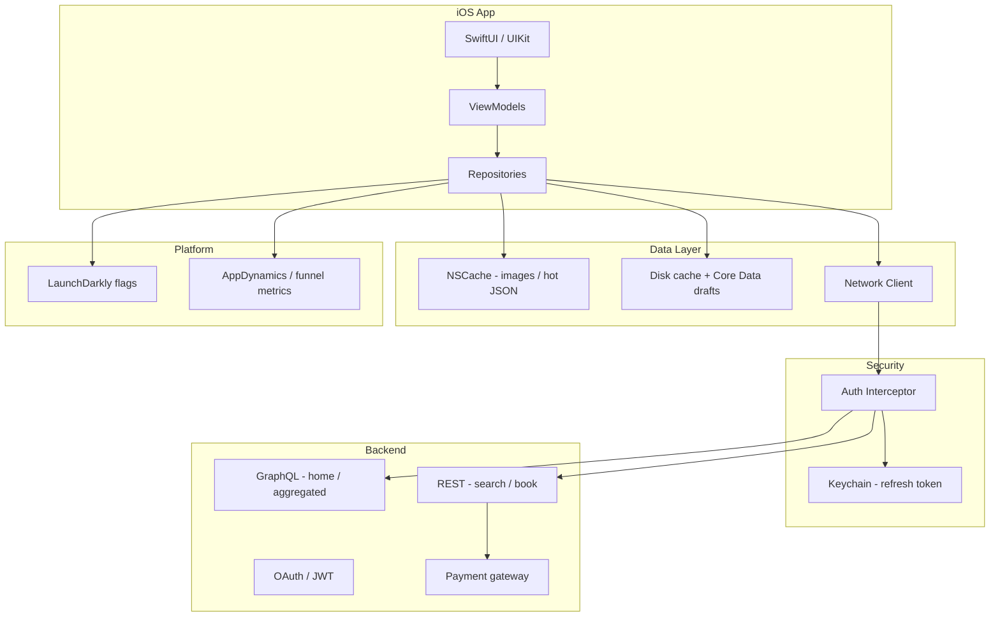

# Hotel Booking App — Architecture Sketch (Day 1 Block D)

**Exercise:** Study this once, then **close the file** and redraw on paper in 15 minutes. Repeat until you can draw from memory in under 10 min.

*Generic design for a global hotel booking platform (based on prior employer experience). No proprietary or confidential implementation details.*

---

## Requirements (state these first in interviews)

**Functional**
- Search hotels by city, dates, guests
- View details, photos, reviews
- Book room + pay (PCI)
- Loyalty points display and apply
- Booking confirmation + history

**Non-functional**
- ~5M DAU, search-heavy read traffic
- p95 search < 300ms on good network
- 99.9% availability for booking path
- Global users, offline draft save for checkout
- PCI-DSS for payments

---

## High-level architecture



---

## Core modules

| Module | Responsibility |
|--------|----------------|
| **Search** | Debounced query, cursor pagination, cache TTL 5 min |
| **HotelDetail** | Images L1/L2 cache, stale-while-revalidate |
| **Booking** | Multi-step funnel, local draft in Core Data |
| **Payment** | Idempotency key, 3DS WebView, no PAN on device |
| **Loyalty** | Server-authoritative points; cache display only |
| **Auth** | Memory access token + Keychain refresh; single-flight refresh |

---

## Booking funnel (draw this box chain)

```
Search → Results → Detail → Guest Info → Payment → Confirm
   ↓         ↓        ↓          ↓           ↓         ↓
 metric   metric   metric     metric      metric    metric
```

**Interview story hook:** Observability traced drop-off at `[your step]` → hotfix → added metrics per box.

---

## API choices (tradeoffs to say aloud)

| Decision | Choice | Why |
|----------|--------|-----|
| Home / loyalty dashboard | GraphQL | One round-trip, aggregated screens |
| Hotel search | REST + cursor | Easier HTTP caching, CDN-friendly |
| Booking submit | REST POST + idempotency key | Retry-safe payments |
| Images | CDN URLs | Thumbnail in list, full on detail |

---

## Caching strategy

| Data | L1 | L2 | Invalidate on |
|------|----|----|----------------|
| Search results | NSCache 5m | Disk 1h | New search, logout |
| Hotel detail | NSCache | Disk | TTL, price change push |
| Images | NSCache | Disk file | URL change |
| Booking draft | — | Core Data | Submit success, logout |

---

## Auth flow

```
Login → access token (memory) + refresh (Keychain)
API call → attach Bearer token
401 → single-flight refresh → retry once
Refresh fail → logout cascade (clear cache, Keychain, cancel tasks)
```

Maps to **Challenge 05** in repo.

---

## Reliability (prior production experience)

- Crash monitoring by release version
- Hotfix branch → QA gate → staged rollout
- LaunchDarkly kill switch on risky features
- Incident RCA template
- Rollback criteria defined before release

---

## Edge cases (mention 3 in interview)

1. Token expires during payment → refresh without losing draft
2. Price changes at checkout → revalidate before charge
3. Double-tap Book → idempotency key + disabled button
4. Network loss mid-checkout → restore draft from Core Data
5. Loyalty points stale → show cached with "refreshing" badge

---

## Redraw checklist (self-check)

After drawing from memory, verify you included:

- [ ] ViewModel layer between UI and Repository
- [ ] Three-tier cache or memory + disk + network
- [ ] Auth interceptor + Keychain (not UserDefaults for tokens)
- [ ] Booking funnel with metrics
- [ ] GraphQL vs REST tradeoff
- [ ] One reliability item (flags, crashes, or hotfix)

**Redrawn from memory:** ⬜ Date: ______ Time: ______ min
